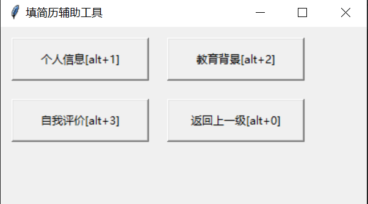
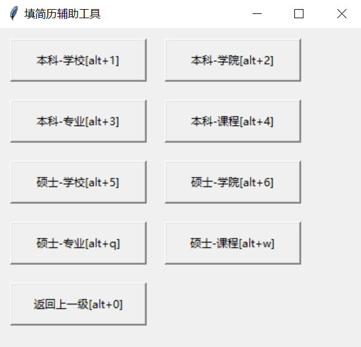

# resume-helper

使用 Python 自带的一个 GUI 库 Tkinter 实现的一个半自动化填简历助手 ，避免填写简历的时候需要不停切换页面复制、粘贴个人信息

## 环境

Windows + Python 3.9.10（macOS 未测，但应该是通用的）

```
pip install -r requirements.txt
```
安装所需依赖，然后 `python main.py` 运行

## 使用方式

修改 resume.json 文件

```json
{
  "个人信息": {
    "姓名": "张三",
    "电话": "123456789",
    "身份证号": "123346679",
    "email": "1123456@xxx.com"
  },
  "教育背景": {
    "本科-学校": "蓝翔",
    "本科-学院": "蓝翔",
    "本科-专业": "挖掘机技术",
    "本科-课程": "挖掘机打野，挖掘机上单，挖掘机中单等",
    "硕士-学校": "门头沟学院",
    "硕士-学院": "门头沟学院",
    "硕士-专业": "...",
    "硕士-课程": "..."
  },
  "自我评价": "1. 具有较强的自我管理能力，坚持每天 rank 上分 \n 2. ... "
}

```
效果如下，点击对应按钮，复制预设信息

<div align=center>

</div>

<div align=center>

</div>


